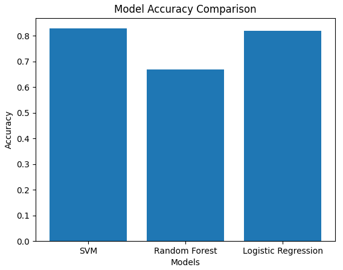
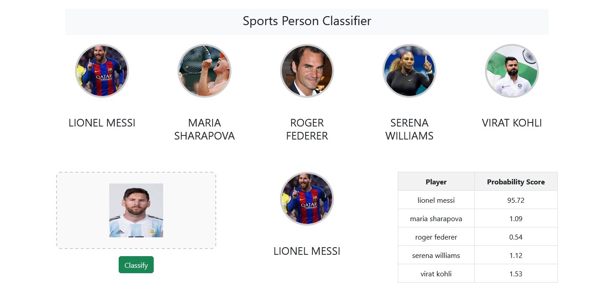

# Image Classifier with Machine Learning

Thanks to Dhaval Sir for this project, checkout his Youtube Channel: [CodeBasics](https://www.youtube.com/@codebasics)

In this project i have used SVM as the accuracy of SVM was around 82%.
I have used React for frontend and python/fastapi for backend along with the trained model.

# Metrics

# Webpage

